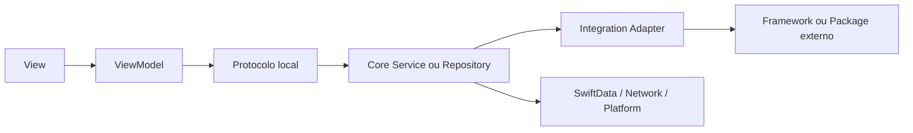
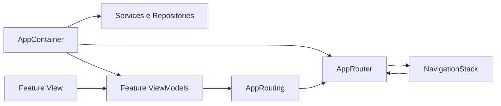
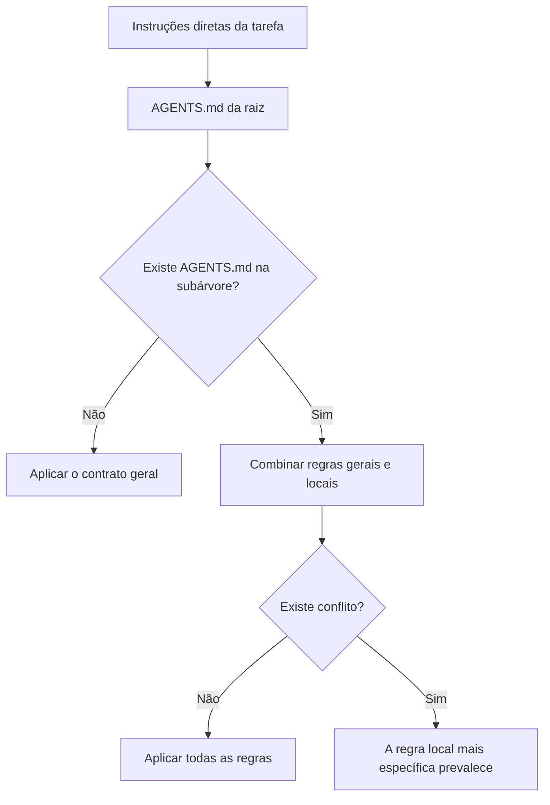

# Contrato padrão para projetos Apple

Este repositório fornece um [`AGENTS.md`](./AGENTS.md) generalista para projetos iOS e macOS escritos em Swift e SwiftUI.

Ele funciona como um contrato de engenharia: descreve a arquitetura esperada, as regras de código, as skills que devem ser usadas, como testar e como validar uma alteração. O Codex pode usar arquivos `AGENTS.md` para entender como navegar pelo repositório, quais comandos executar e quais práticas seguir, conforme explica a [documentação da OpenAI](https://openai.com/index/introducing-codex/).

O arquivo não cria um projeto, não instala dependências e não é um Swift Package. Adotá-lo significa copiar o `AGENTS.md` para o projeto que deve seguir essas regras.

## O que este contrato define

- Swift 6 com strict concurrency.
- Deployment targets explícitos e APIs modernas não depreciadas.
- Arquitetura MVVM para telas e componentes com comportamento.
- Separação entre `Resources`, `Sources` e `Tests`.
- Organização de código compartilhado em `Core`.
- Organização da interface por feature em `Features`.
- SwiftData versionado quando houver persistência.
- Isolamento de packages externos por adapters locais.
- TDD para comportamento e proibição de testes de View.
- Previews para todos os estados visuais significativos.
- Navegação centralizada com `NavigationStack`, `AppRouter` e `AppContainer`.
- Ações principais em `.toolbar` e acessórios persistentes com `.safeAreaInset`.
- Botões com toda a área visual interativa e preferência por estilos Glass.
- Uso explícito das skills e plugins Build iOS Apps e Build macOS Apps.

## Como instalar

### 1. Obtenha este repositório

```bash
git clone git@github.com:didisouzacosta/iOSAgentsDefault.git
```

### 2. Copie o contrato

Na raiz do projeto de destino:

```bash
cp /caminho/para/iOSAgentsDefault/AGENTS.md ./AGENTS.md
```

O resultado deve ser:

```text
MyApp/
├── AGENTS.md
├── Resources/
├── Sources/
└── Tests/
```

### 3. Declare as particularidades do projeto

O contrato exige que cada projeto informe seus deployment targets, comandos de build e detalhes que não podem ser generalizados.

Essas regras particulares podem ser adicionadas:

- em um `AGENTS.md` mais específico dentro de uma pasta; ou
- em outro documento explicitamente referenciado pelo `AGENTS.md` raiz.

### 4. Versione o contrato

Mantenha o `AGENTS.md` no Git junto com o código. Assim, agentes e pessoas usam a mesma versão das regras.

## Arquitetura esperada

Apps criados com Xcode devem seguir esta organização:

```text
MyApp/
├── AGENTS.md
├── README.md
├── Resources/
│   ├── Assets.xcassets
│   ├── Localization/
│   ├── Fonts/
│   ├── Audio/
│   ├── Video/
│   └── Preview Content/
├── Sources/
│   ├── App/
│   │   ├── MyAppApp.swift
│   │   ├── AppRouter.swift
│   │   └── AppContainer.swift
│   ├── Core/
│   │   ├── Data/
│   │   ├── Helpers/
│   │   ├── Integrations/
│   │   ├── Managers/
│   │   ├── Network/
│   │   ├── Persistence/
│   │   ├── Platform/
│   │   └── Services/
│   └── Features/
│       ├── Home/
│       │   ├── HomeView.swift
│       │   ├── HomeViewModel.swift
│       │   └── Components/
│       │       ├── HomeHeroView.swift
│       │       └── HomeContentView.swift
│       ├── Profile/
│       │   ├── ProfileView.swift
│       │   ├── ProfileViewModel.swift
│       │   └── Components/
│       └── SignIn/
│           ├── SignInView.swift
│           ├── SignInViewModel.swift
│           └── Components/
└── Tests/
    ├── Core/
    └── Features/
        ├── Home/
        ├── Profile/
        └── SignIn/
```

### Resources

`Resources/` guarda tudo que será empacotado com o app e não é código-fonte, como:

- imagens e catálogos de assets;
- textos localizados;
- fontes;
- áudio e vídeo;
- arquivos de dados incluídos no bundle;
- recursos usados por previews.

### Sources/App

`Sources/App/` é a raiz de composição do aplicativo. Nela ficam o entry point, o Router, o container de dependências e integrações do ciclo de vida.

### Sources/Core

`Sources/Core/` contém funcionamento compartilhado por várias features:

| Pasta | Responsabilidade |
| --- | --- |
| `Data` | Valores compartilhados, DTOs, protocolos de repositórios e mapeamento |
| `Helpers` | Utilitários pequenos, coesos e realmente reutilizados |
| `Integrations` | Adapters de packages e SDKs externos |
| `Managers` | Coordenação de recursos ou ciclos de vida compartilhados |
| `Network` | Transporte, endpoints, requests, responses e clientes |
| `Persistence` | SwiftData, schemas, migrations e containers |
| `Platform` | Implementações específicas de iOS ou macOS |
| `Services` | Operações e serviços compartilhados do aplicativo |

`Core` não é uma pasta para código sem destino. Se algo pertence apenas ao Profile, por exemplo, deve continuar dentro da feature Profile.

### Sources/Features

Cada funcionalidade possui seu próprio módulo de apresentação:

```text
Sources/Features/Profile/
├── ProfileView.swift
├── ProfileViewModel.swift
└── Components/
    ├── ProfileSummaryView.swift
    └── ProfileDetailsView.swift
```

A View principal e o ViewModel ficam na raiz da feature. Toda composição visual não trivial fica em um arquivo próprio dentro de `Components/`.

O padrão é um tipo principal `View` por arquivo. Uma View auxiliar só pode permanecer no mesmo arquivo quando for privada, sem estado ou ações, usada uma única vez e realmente simples.

### Tests

`Tests/` espelha a estrutura de produção:

```text
Tests/
├── Core/
│   ├── Network/
│   └── Persistence/
└── Features/
    └── Profile/
        └── ProfileViewModelTests.swift
```

Os testes cobrem ViewModels, services, repositories, adapters, migrations e transformações. O contrato proíbe testes de View, UI tests e snapshots.

## Fluxo entre as camadas

Uma View conversa apenas com seu ViewModel. O ViewModel depende de protocolos locais, e as implementações concretas ficam em `Core`.



Esse fluxo impede que SwiftData, clientes de rede ou tipos de packages externos vazem para a interface.

## Navegação e injeção de dependências

Todo fluxo de navegação em pilha usa `NavigationStack`. `NavigationView`, booleans de navegação e troca manual da View raiz não fazem parte do padrão.

A navegação e a composição do app possuem responsabilidades separadas:

- `AppContainer` cria e mantém services, repositories, adapters e outras dependências de longa duração.
- `AppContainer` fornece os ViewModels necessários para cada feature.
- `AppRouter` mantém rotas tipadas, paths e apresentações.
- `AppRouting` é a abstração usada pelos ViewModels para solicitar navegação.
- A View raiz conecta o path do `AppRouter` ao `NavigationStack` e resolve os destinos com `navigationDestination(for:)`.
- Views e ViewModels de features nunca constroem Views de destino.



No macOS e em interfaces de largura regular, `NavigationSplitView` continua sendo o container nativo para sidebar e detail. Quando uma coluna permite aprofundar a navegação, ela usa `NavigationStack`.

## Ações, barras e área segura

As ações principais de uma tela devem usar o modificador `.toolbar`, com `ToolbarItem` e placement adequado à plataforma.

- No iOS, a toolbar pode posicionar ações no topo ou em `bottomBar`.
- No macOS, devem ser preservadas toolbar, commands e convenções nativas da janela.
- Não crie headers, footers, top bars, bottom bars ou `HStack` fixos para imitar uma toolbar.
- Headers e footers semânticos de `Section` continuam válidos quando servem para identificar ou explicar conteúdo.

Quando um conteúdo persistente não for uma ação de toolbar — por exemplo, composer, player ou status — use `.safeAreaInset(edge:)`. Isso mantém o layout correto enquanto o conteúdo rolável passa pela região correspondente, sem padding calculado, medições manuais ou overlays que escondem conteúdo.

## Botões e área de toque

Toda a área visual de um `Button` deve responder à interação.

- Padding e frame fazem parte do label do Button para ampliar sua região interativa.
- `contentShape` define a forma tocável quando o label customizado não representa naturalmente toda a superfície.
- `onTapGesture` não deve ser usado para imitar um Button.
- Em plataformas touch, o botão deve manter uma área confortável de toque.
- No macOS, deve preservar o tamanho de controle e comportamento de ponteiro apropriados.

## Minimum target e fallbacks

Antes de criar qualquer fallback, verifique o minimum target efetivo de todos os targets afetados: app, extensions, frameworks e packages.

- Se todos os targets já suportam a API, use-a diretamente.
- Não crie `#available`, caminhos duplicados ou estilos antigos por precaução.
- Se os targets forem diferentes, concentre a compatibilidade na menor fronteira compartilhada.
- Um fallback só existe quando algum binário afetado realmente pode executar em uma versão anterior.

Essa análise também se aplica a Liquid Glass. Quando o minimum target oferece o recurso, prefira `.glass` para ações compatíveis e `.glassProminent` para a ação principal. Controles de sistema e toolbars podem receber Glass automaticamente, portanto não se deve aplicar `glassEffect` novamente sem necessidade.

## Como combinar com regras específicas

O contrato é uma base, não um limite. Um projeto pode acrescentar regras de produto, convenções de domínio, comandos próprios e decisões arquiteturais mais específicas.

### Opção 1: AGENTS.md aninhado

Use um `AGENTS.md` dentro de uma subpasta quando a regra pertence somente àquela área:

```text
MyApp/
├── AGENTS.md
└── Sources/
    └── Features/
        └── Camera/
            ├── AGENTS.md
            ├── CameraView.swift
            └── CameraViewModel.swift
```

O contrato da raiz continua valendo. O arquivo em `Camera/` acrescenta regras para aquela subárvore e prevalece quando houver um conflito dentro dela.

### Opção 2: documento particular referenciado

Também é possível manter regras particulares em outro documento:

```text
MyApp/
├── AGENTS.md
└── docs/
    └── PROJECT_RULES.md
```

Nesse caso, adicione ao `AGENTS.md` raiz uma instrução explícita:

```markdown
## Project-specific rules

Before editing project code, read `docs/PROJECT_RULES.md`.
That document extends this contract for the entire repository.
```

Um arquivo Markdown arbitrário não é carregado automaticamente. Ele precisa ser citado pelo `AGENTS.md`, por outro arquivo de instruções aplicável ou pelo pedido feito ao agente.

## Precedência das regras

O Codex agrega instruções de diferentes níveis. Em geral, instruções diretas têm prioridade sobre arquivos do repositório, e um `AGENTS.md` mais próximo do arquivo alterado é mais específico que o contrato da raiz. A OpenAI descreve esse processamento no artigo [Unrolling the Codex agent loop](https://openai.com/index/unrolling-the-codex-agent-loop/).



Regras de sistema, desenvolvedor ou usuário continuam acima das instruções do repositório.

## Como atualizar sem perder personalizações

Para facilitar futuras atualizações:

1. mantenha o contrato geral no `AGENTS.md` raiz;
2. mantenha particularidades em arquivos aninhados ou em `docs/PROJECT_RULES.md`;
3. ao atualizar esta base, compare o novo arquivo antes de substituir o atual;
4. restaure ou preserve a referência ao documento específico do projeto;
5. revise conflitos intencionais e registre seu escopo.

Evite editar muitas regras particulares diretamente no meio do contrato geral. Separá-las reduz conflitos e deixa claro o que veio desta base.

## Swift Packages

Esta árvore é obrigatória para apps Xcode. Swift Packages precisam respeitar a estrutura esperada pelo SwiftPM, mas devem preservar os mesmos limites lógicos entre App, Core, Features, Resources e Tests dentro de seus targets.

## Checklist de adoção

- [ ] `AGENTS.md` copiado para a raiz.
- [ ] Deployment targets declarados.
- [ ] Comandos específicos de build e validação documentados.
- [ ] Regras particulares separadas e explicitamente referenciadas.
- [ ] Projeto organizado em `Resources`, `Sources` e `Tests`.
- [ ] `Sources/Core` contém somente infraestrutura compartilhada.
- [ ] Cada feature contém View, ViewModel e `Components`.
- [ ] `AppRouter` e `AppContainer` centralizam navegação e dependências.
- [ ] Todo fluxo em pilha usa `NavigationStack`.
- [ ] Ações principais usam `.toolbar`.
- [ ] Acessórios persistentes usam `.safeAreaInset` quando aplicável.
- [ ] Botões respondem em toda a área visual.
- [ ] Fallbacks existem somente quando o minimum target realmente exige.
- [ ] Packages externos estão isolados em adapters.
- [ ] O contrato foi revisado e versionado com o projeto.
